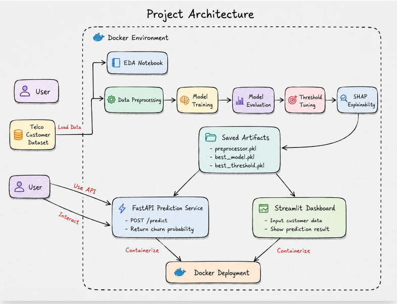

# 📉 Customer Churn Prediction System


## 📌 Overview

**Customer Churn Prediction System** is an end-to-end machine learning project designed to predict whether a customer is likely to leave a service.

This project covers the complete machine learning workflow, including exploratory data analysis, data preprocessing, model training, threshold tuning, model explainability, API development, dashboard development, and Docker deployment.

The goal is not only to build a predictive model, but also to support business decision-making through churn risk segmentation and recommended retention actions.

---

## 🎯 Business Problem

Customer churn is a major challenge for subscription-based businesses. Losing existing customers can reduce revenue and increase customer acquisition costs.

By predicting churn risk early, businesses can proactively identify customers who are likely to leave and design targeted retention strategies.

This system helps businesses:

- Identify high-risk customers
- Prioritize retention campaigns
- Offer personalized incentives
- Improve customer lifetime value
- Reduce revenue loss caused by customer attrition

---

## 🚀 Project Objectives

The main objectives of this project are:

- Analyze customer churn behavior through exploratory data analysis
- Build machine learning models to predict churn probability
- Compare model performance using classification metrics
- Tune the prediction threshold to better support business objectives
- Explain model predictions using SHAP
- Provide churn predictions through a FastAPI service
- Build an interactive Streamlit dashboard for business users
- Containerize the project using Docker
- Recommend retention actions based on customer risk level

---

## 🗂️ Dataset

This project uses the **Telco Customer Churn dataset**.

The dataset contains customer-level information, including:

- Customer demographics
- Account information
- Internet and phone services
- Contract type
- Payment method
- Monthly charges
- Total charges
- Tenure
- Churn label

Target variable:

```text
Churn: Yes / No
```

---

## 🏗️ System Architecture



---

## 📁 Project Structure

```text
Customer-Churn-Prediction-System/
│
├── api/
│   ├── __init__.py
│   └── main.py
│
├── app/
│   └── streamlit_app.py
│
├── data/
│   ├── raw/
│   │   └── telco_churn.csv
│   └── processed/
│       ├── X_train.pkl
│       ├── X_test.pkl
│       ├── y_train.pkl
│       └── y_test.pkl
│
├── models/
│   ├── preprocessor.pkl
│   ├── best_model.pkl
│   └── best_threshold.pkl
│
├── notebooks/
│   └── eda_customer_churn_analysis.ipynb
│
├── reports/
│   ├── figures/
│   │   ├── shap_feature_importance.png
│   │   └── shap_summary_plot.png
│   ├── model_report.md
│   ├── threshold_tuning_report.csv
│   └── shap_feature_importance.csv
│
├── src/
│   ├── __init__.py
│   ├── utils.py
│   ├── data_preprocessing.py
│   ├── train.py
│   ├── threshold_tuning.py
│   ├── explain_model.py
│   └── predict.py
│
├── .dockerignore
├── .gitignore
├── Dockerfile
├── requirements.txt
└── README.md
```


---

## 🔍 [Exploratory Data Analysis](notebooks/eda_customer_churn_analysis.ipynb)

The exploratory data analysis stage focuses on understanding customer churn behavior and identifying important business patterns.

Main analysis areas include:

- Churn distribution
- Churn rate by contract type
- Churn rate by tenure group
- Churn rate by internet service
- Churn rate by payment method
- Relationship between monthly charges and churn
- Relationship between tenure and churn
- Impact of support-related services such as Online Security and Tech Support

Key business findings:

- Customers with month-to-month contracts have a higher churn rate.
- Customers with shorter tenure are more likely to churn.
- Customers with higher monthly charges tend to have higher churn risk.
- Customers using electronic check show higher churn risk.
- Customers without support services such as Online Security or Tech Support tend to churn more.

---

## 🧹 Data Preprocessing

The preprocessing pipeline includes:

- Dropping irrelevant identifier columns
- Converting `TotalCharges` into numeric format
- Handling missing values using median imputation
- Encoding categorical variables using `OneHotEncoder`
- Scaling numerical variables using `StandardScaler`
- Splitting data into training and testing sets
- Saving the fitted preprocessor for future predictions

The saved preprocessor ensures that new customer data is transformed in the same way as the training data.

---

## 🤖 Machine Learning Models

The project compares multiple classification models:

- Logistic Regression
- Random Forest
- XGBoost

The models are evaluated using:

- Accuracy
- Precision
- Recall
- F1-score
- ROC-AUC

Since this is a churn prediction problem, recall is especially important because missing high-risk churn customers may lead to lost retention opportunities.

---

## 📊 Model Performance

Initial model comparison:

| Model | Accuracy | Precision | Recall | F1-score | ROC-AUC |
|---|---:|---:|---:|---:|---:|
| Logistic Regression | 0.7381 | 0.5043 | 0.7834 | 0.6136 | 0.8413 |
| Random Forest | 0.7821 | 0.6175 | 0.4706 | 0.5341 | 0.8217 |
| XGBoost | 0.8041 | 0.6644 | 0.5294 | 0.5893 | 0.8422 |

XGBoost achieved the highest ROC-AUC score and was selected as the best model.

However, Logistic Regression achieved the highest recall. This shows an important business trade-off: a model with higher accuracy is not always the best model for churn prevention.

---

## 🎚️ Threshold Tuning

After selecting XGBoost as the best model based on ROC-AUC, threshold tuning was applied to better align the model with the business objective of churn prevention.

Default threshold:

```text
threshold = 0.5
```

Optimized threshold:

```text
threshold = 0.3
```

Performance after threshold tuning:

| Metric | Value |
|---|---:|
| Accuracy | 0.7615 |
| Precision | 0.5356 |
| Recall | 0.7647 |
| F1-score | 0.6300 |
| ROC-AUC | 0.8422 |

The optimized threshold increased recall from `0.5294` to `0.7647`.

This trade-off is suitable for churn prediction because it is often better to identify more high-risk customers, even if some non-churn customers are also flagged for retention actions.

---

## 🧠 Model Explainability with SHAP

To improve model transparency, this project uses **SHAP (SHapley Additive exPlanations)** to explain how different features contribute to churn predictions.

SHAP helps answer important business questions such as:

- Which features have the strongest impact on churn prediction?
- Which customer characteristics increase churn risk?
- Which factors reduce churn risk?
- Why does the model classify a customer as high-risk?

The project generates SHAP outputs including:

- SHAP summary plot
- SHAP feature importance plot
- SHAP feature importance report

These explainability results help make the model more understandable for business users and support data-driven retention strategies.

### SHAP Outputs

```text
reports/figures/shap_feature_importance.png
reports/figures/shap_summary_plot.png
reports/shap_feature_importance.csv
```

---

## 🔮 Prediction Output

The prediction system returns:

- Churn probability
- Decision threshold
- Churn prediction
- Prediction label
- Risk level
- Recommended retention action

Example output:

```json
{
  "churn_probability": 0.7992,
  "threshold": 0.3,
  "churn_prediction": 1,
  "prediction_label": "Churn",
  "risk_level": "High",
  "recommended_action": "Offer a personalized discount, contact the customer proactively, and suggest a contract upgrade."
}
```

---

## ⚡ FastAPI Prediction Service

The project includes a FastAPI service for churn prediction.

### API Endpoints

```http
GET /
```

Returns a basic message that the API is running.

```http
GET /health
```

Returns the API health status.

```http
POST /predict
```

Predicts churn probability for a customer.

### Example Request

```json
{
  "gender": "Female",
  "SeniorCitizen": 0,
  "Partner": "Yes",
  "Dependents": "No",
  "tenure": 5,
  "PhoneService": "Yes",
  "MultipleLines": "No",
  "InternetService": "Fiber optic",
  "OnlineSecurity": "No",
  "OnlineBackup": "No",
  "DeviceProtection": "No",
  "TechSupport": "No",
  "StreamingTV": "Yes",
  "StreamingMovies": "Yes",
  "Contract": "Month-to-month",
  "PaperlessBilling": "Yes",
  "PaymentMethod": "Electronic check",
  "MonthlyCharges": 90.5,
  "TotalCharges": 452.5
}
```

### Example Response

```json
{
  "churn_probability": 0.7992,
  "threshold": 0.3,
  "churn_prediction": 1,
  "prediction_label": "Churn",
  "risk_level": "High",
  "recommended_action": "Offer a personalized discount, contact the customer proactively, and suggest a contract upgrade."
}
```

---

## 🖥️ Streamlit Dashboard

The project also includes an interactive Streamlit dashboard.

Main features:

- Input customer profile
- Enter contract and service information
- Enter billing information
- Predict churn probability
- Display churn label
- Display customer risk level
- Recommend retention action
- Show input data in JSON format

This dashboard allows business users to interact with the churn prediction model without writing code.

---

## 🐳 Docker Deployment

This project supports Docker deployment for better reproducibility and easier setup.

Docker is used to package the application, dependencies, model files, and source code into a container so the project can run consistently across different environments.

### Build Docker Image

```bash
docker build -t customer-churn-prediction .
```

### Run FastAPI with Docker

```bash
docker run -p 8000:8000 customer-churn-prediction
```

FastAPI will be available at:

```text
http://localhost:8000/docs
```

### Run Streamlit with Docker

```bash
docker run -p 8501:8501 customer-churn-prediction streamlit run app/streamlit_app.py --server.address=0.0.0.0 --server.port=8501
```

Streamlit will be available at:

```text
http://localhost:8501
```

---

## 🛠️ Technologies Used

- Python 3.11
- Pandas
- NumPy
- Scikit-learn
- XGBoost
- Matplotlib
- Seaborn
- SHAP
- FastAPI
- Pydantic
- Uvicorn
- Streamlit
- Joblib
- Docker

---

## ⚙️ Installation

### 1. Clone the repository

```bash
git clone https://github.com/ChiBao-v/Customer-Churn-Prediction-System
cd Customer-Churn-Prediction-System
```

### 2. Create a virtual environment

```bash
py -3.11 -m venv .venv
```

### 3. Activate the virtual environment

Windows PowerShell:

```bash
.venv\Scripts\activate
```

If PowerShell blocks script execution, run:

```bash
Set-ExecutionPolicy -Scope Process -ExecutionPolicy RemoteSigned
.venv\Scripts\activate
```

### 4. Install dependencies

```bash
pip install -r requirements.txt
```

---

## ▶️ How to Run the Project

### 1. Run data preprocessing

```bash
python -m src.data_preprocessing
```

### 2. Train models

```bash
python -m src.train
```

### 3. Tune prediction threshold

```bash
python -m src.threshold_tuning
```

### 4. Generate SHAP explanations

```bash
python -m src.explain_model
```

### 5. Test prediction function

```bash
python -m src.predict
```

### 6. Run FastAPI server

```bash
uvicorn api.main:app --reload
```

Open the API documentation:

```text
http://127.0.0.1:8000/docs
```

### 7. Run Streamlit dashboard

```bash
streamlit run app/streamlit_app.py
```

Open the dashboard:

```text
http://localhost:8501
```

---

## 💼 Business Impact

This project can help businesses:

- Detect customers with high churn risk
- Prioritize retention campaigns
- Reduce customer attrition
- Improve customer lifetime value
- Support targeted marketing strategies
- Make data-driven customer retention decisions

Instead of applying the same promotion to all customers, businesses can focus resources on customers who are more likely to churn.

---

## 🔧 Future Improvements

Possible future improvements include:

- Hyperparameter tuning using `RandomizedSearchCV` or `GridSearchCV`
- Advanced feature engineering
- Model monitoring
- Automated retraining pipeline
- Cloud deployment
- CI/CD pipeline for automated testing and deployment
- Integration with CRM systems
- Batch prediction for multiple customers

---

## 👤 Author

**Chi Bao**

---

## 📄 License

This project is created for educational and portfolio purposes.